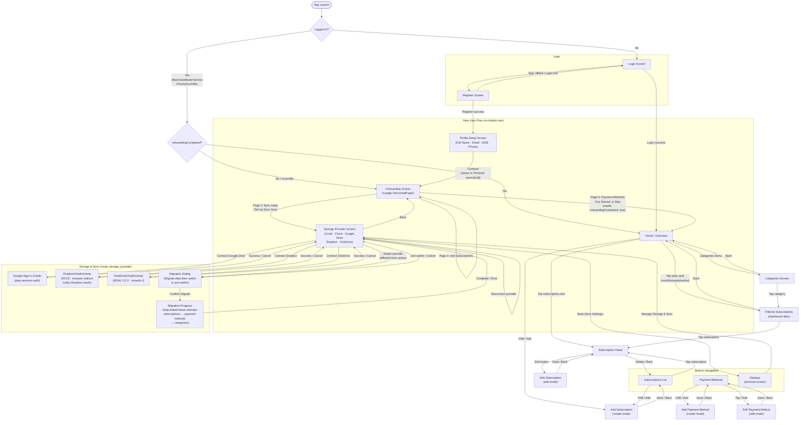

```mermaid
flowchart TD
    Start([App Launch]) --> AuthCheck{Logged In?}

    AuthCheck -- No --> Login
    AuthCheck -- "Yes\n(MainViewModel fetches\nFirestore profile)" --> OnboardingCheck{onboardingCompleted?}

    OnboardingCheck -- No / no profile --> Onboarding
    OnboardingCheck -- Yes --> Home

    subgraph Auth
        Login[Login Screen]
        Register[Register Screen]
        Login -- "Sign Up link" --> Register
        Register -- "Back / Login link" --> Login
    end

    Login -- "Login success" --> Home

    Register -- "Register success" --> ProfileSetup

    subgraph NewUserFlow["New User Flow (no bottom nav)"]
        ProfileSetup["Profile Setup Screen\n(Full Name · Email · DOB · Phone)"]
        Onboarding["Onboarding Screen\n(4-page HorizontalPager)"]

        ProfileSetup -- "Continue\n(saves to Firestore users/{uid})" --> Onboarding

        Onboarding -- "Page 1: Welcome to Subly" --> Onboarding
        Onboarding -- "Page 2: Sync setup\n'Set Up Sync Now'" --> StorageProviderScreen
        StorageProviderScreen -- "Back" --> Onboarding
        Onboarding -- "Page 3: Add Subscriptions" --> Onboarding
        Onboarding -- "Page 4: Payment Methods\n'Get Started' or Skip\n(marks onboardingCompleted: true)" --> Home
    end

    subgraph BottomNav["Bottom Navigation"]
        Home[Home / Overview]
        Subscriptions[Subscriptions List]
        PaymentMethods[Payment Methods]
        Settings[Settings]
    end

    Home -- "Tap subscription card" --> SubscriptionDetail
    Home -- "FAB / Add" --> AddEditSubscription_New["Add Subscription\n(create mode)"]
    Home -- "Tap stats card\n(monthly/yearly/active)" --> FilteredSubscriptions
    Home -- "Categories menu" --> Categories

    Subscriptions -- "Tap subscription" --> SubscriptionDetail
    Subscriptions -- "FAB / Add" --> AddEditSubscription_New

    FilteredSubscriptions["Filtered Subscriptions\n(dashboard filter)"] -- "Tap subscription" --> SubscriptionDetail
    FilteredSubscriptions -- "Back" --> Home

    Categories["Categories Screen"] -- "Tap category" --> FilteredSubscriptions
    Categories -- "Back" --> Home

    SubscriptionDetail["Subscription Detail"] -- "Edit button" --> AddEditSubscription_Edit["Edit Subscription\n(edit mode)"]
    SubscriptionDetail -- "Delete / Back" --> Subscriptions

    AddEditSubscription_New -- "Save / Back" --> Subscriptions
    AddEditSubscription_Edit -- "Save / Back" --> SubscriptionDetail

    PaymentMethods -- "FAB / Add" --> AddEditPaymentMethod_New["Add Payment Method\n(create mode)"]
    PaymentMethods -- "Tap / Edit" --> AddEditPaymentMethod_Edit["Edit Payment Method\n(edit mode)"]

    AddEditPaymentMethod_New -- "Save / Back" --> PaymentMethods
    AddEditPaymentMethod_Edit -- "Save / Back" --> PaymentMethods

    Settings -- "Manage Storage & Sync" --> StorageProviderScreen

    subgraph StorageSync["Storage & Sync (route: storage_provider)"]
        StorageProviderScreen["Storage Provider Screen\n(Local · Cloud · Google Drive\nDropbox · OneDrive)"]

        StorageProviderScreen -- "Connect Google Drive" --> GoogleSignIn["Google Sign-In OAuth\n(play-services-auth)"]
        GoogleSignIn -- "Success / Cancel" --> StorageProviderScreen

        StorageProviderScreen -- "Connect Dropbox" --> DropboxOAuth["DropboxOAuthActivity\n(PKCE · browser redirect\nsubly://dropbox-oauth)"]
        DropboxOAuth -- "Success / Cancel" --> StorageProviderScreen

        StorageProviderScreen -- "Connect OneDrive" --> OneDriveOAuth["OneDriveOAuthActivity\n(MSAL 5.3.0 · msauth://)"]
        OneDriveOAuth -- "Success / Cancel" --> StorageProviderScreen

        StorageProviderScreen -- "Switch provider\n(different from active)" --> MigrationDialog["Migration Dialog\n(Migrate data then switch\nor just switch)"]
        MigrationDialog -- "Confirm migrate" --> MigrationProgress["Migration Progress\n(step-based linear indicator\nsubscriptions → payment methods\n→ categories)"]
        MigrationProgress -- "Complete / Error" --> StorageProviderScreen
        MigrationDialog -- "Just switch / Cancel" --> StorageProviderScreen

        StorageProviderScreen -- "Sync Now" --> StorageProviderScreen
        StorageProviderScreen -- "Disconnect provider" --> StorageProviderScreen
    end

    StorageProviderScreen -- "Back (from Settings)" --> Settings

    Settings["Settings\n(terminal screen)"]
```
