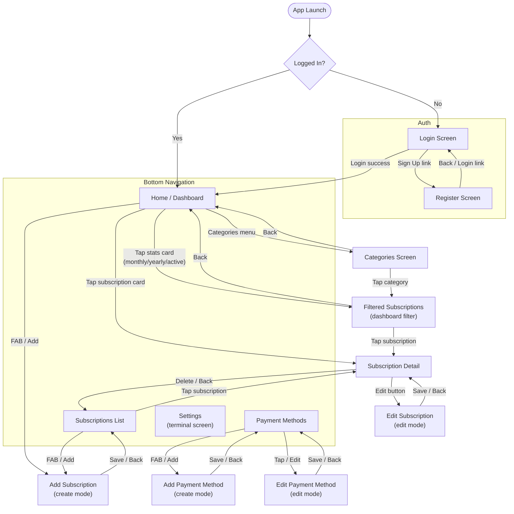

```mermaid
flowchart TD
    Start([App Launch]) --> AuthCheck{Logged In?}

    AuthCheck -- No --> Login
    AuthCheck -- Yes --> Home

    subgraph Auth
        Login[Login Screen]
        Register[Register Screen]
        Login -- "Sign Up link" --> Register
        Register -- "Back / Login link" --> Login
    end

    Login -- "Login success" --> Home

    subgraph BottomNav["Bottom Navigation"]
        Home[Home / Dashboard]
        Subscriptions[Subscriptions List]
        PaymentMethods[Payment Methods]
        Settings[Settings]
    end

    Home -- "Tap subscription card" --> SubscriptionDetail
    Home -- "FAB / Add" --> AddEditSubscription_New["Add Subscription\n(create mode)"]
    Home -- "Tap stats card\n(monthly/yearly/active)" --> FilteredSubscriptions
    Home -- "Categories menu" --> Categories

    Subscriptions -- "Tap subscription" --> SubscriptionDetail
    Subscriptions -- "FAB / Add" --> AddEditSubscription_New

    FilteredSubscriptions["Filtered Subscriptions\n(dashboard filter)"] -- "Tap subscription" --> SubscriptionDetail
    FilteredSubscriptions -- "Back" --> Home

    Categories["Categories Screen"] -- "Tap category" --> FilteredSubscriptions
    Categories -- "Back" --> Home

    SubscriptionDetail["Subscription Detail"] -- "Edit button" --> AddEditSubscription_Edit["Edit Subscription\n(edit mode)"]
    SubscriptionDetail -- "Delete / Back" --> Subscriptions

    AddEditSubscription_New -- "Save / Back" --> Subscriptions
    AddEditSubscription_Edit -- "Save / Back" --> SubscriptionDetail

    PaymentMethods -- "FAB / Add" --> AddEditPaymentMethod_New["Add Payment Method\n(create mode)"]
    PaymentMethods -- "Tap / Edit" --> AddEditPaymentMethod_Edit["Edit Payment Method\n(edit mode)"]

    AddEditPaymentMethod_New -- "Save / Back" --> PaymentMethods
    AddEditPaymentMethod_Edit -- "Save / Back" --> PaymentMethods

    Settings["Settings\n(terminal screen)"]
```
